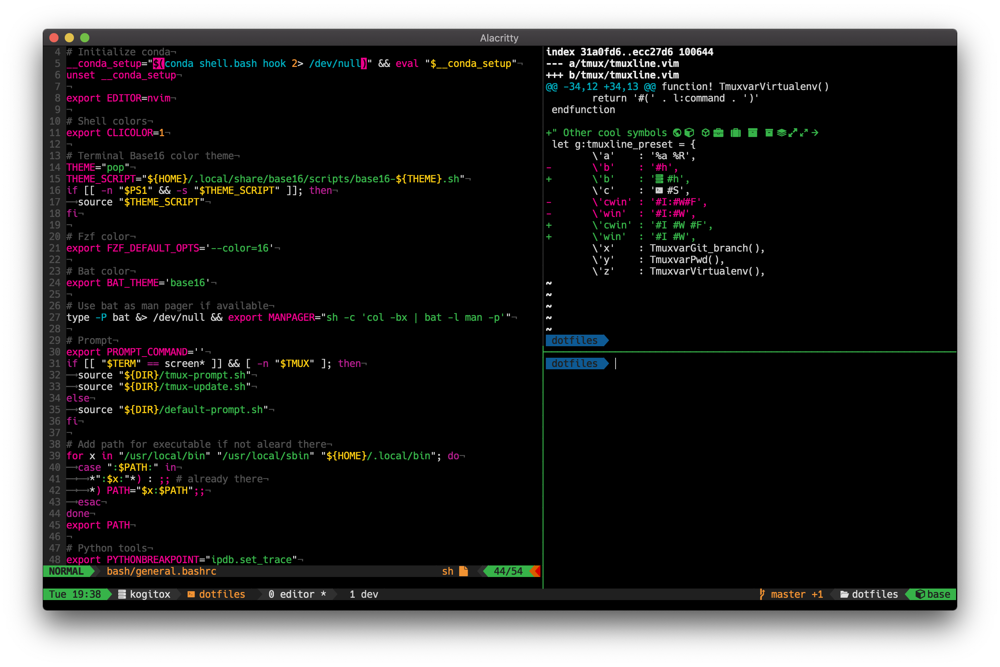

# Dotfiles
My collection of \*nix configuration files, from .bashrc to vim.
These are intended to use with [Tmux](https://github.com/tmux/tmux/wiki) and
[(Neo)Vim](https://neovim.io/).

Among many independent projects referenced in the configs, a few special ones
where critical for setting the various styles, namely
  - [vim-airline](https://github.com/vim-airline/vim-airline) for creating
    the beautiful vim statusline;
  - [promtpline.vim](https://github.com/edkolev/promptline.vim) for creating
    a shell prompt matching airline style;
  - [tmuxline.vim](https://github.com/edkolev/tmuxline.vim) for customizing
    the tmux status bar;
  - [base16](https://github.com/chriskempson/base16) for setting various
    themes in relative ANSI color, hence using the same colors in severals
    applictions (`neovim`, `tmux`, prompt, terminal commands such as `ls` and
    `git`, _etc._);
  - [Nerd Fonts](https://www.nerdfonts.com/) for patching font with symbols.
 
External dependencies required for this project and not resolved by the config files:
  - [Tmux](https://github.com/tmux/tmux/wiki)
  - [NeoVim](https://neovim.io/)
  - [Nerd Fonts](https://www.nerdfonts.com/)

